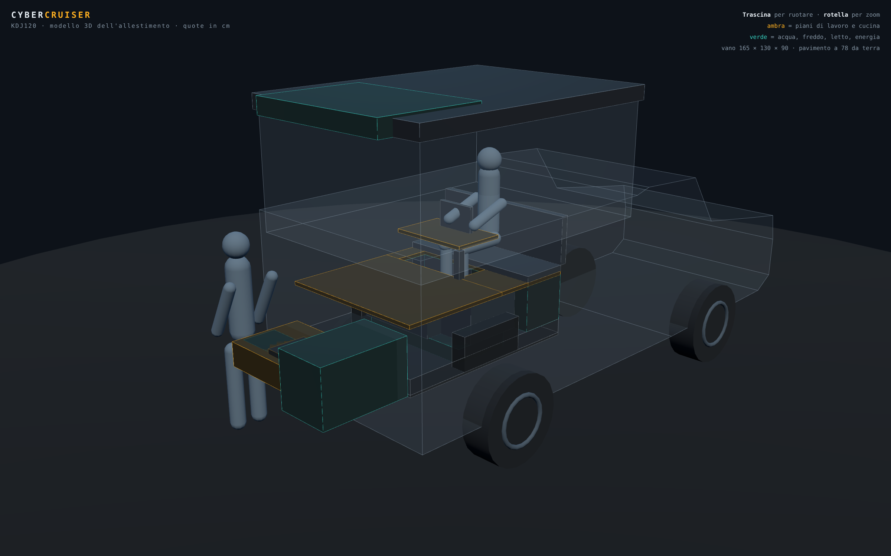

# Modello 3D dell'allestimento

Modello navigabile del vano posteriore camperizzato, costruito **dalle stesse
quote dei disegni 2D** (`../docs/disegni/quote.mjs`): cambia una misura lì e si
aggiornano insieme tavole, PDF e modello.



## Aprirlo

```bash
# dalla radice del repo
python3 -m http.server 8099      # poi http://localhost:8099/landcruiser/3d/
```

Oppure la versione in un file solo, che si apre anche da chiavetta o telefono:

```bash
node tools/build-single.mjs      # → dist/cyber-cruiser-3d.html (~1 MB)
```

Three.js è vendorizzato in `vendor/` (licenza MIT, `vendor/LICENSE-three.txt`):
**nessuna richiesta di rete**, funziona offline.

## Cosa puoi muovere

| Comando | Cosa mostra |
|---|---|
| SOFFIETTO | apertura del tetto: +95 cm, 185 di altezza interna |
| CUCINA | estrazione di 60 cm dal portellone, piano a 98 cm da terra |
| FRIGO | slitta del frigo, corsa 40 cm |
| LETTO | ripiegato (giorno) ↔ disteso 190 × 130 (notte) |
| SCRIVANIA | postazione PC dentro ↔ tavolo ruotato fuori dal portellone |
| PERSONE | sagome da 175 cm: il metro di riferimento vero |

Viste preimpostate: 3/4 posteriore, laterale, da dietro, dall'alto, interno.
Trascina per ruotare, rotella per lo zoom.

## Render statici

```bash
node tools/render.mjs            # → ../docs/disegni/render/*.png
```

Sei inquadrature (giorno, cucina in uso, postazione PC, notte, dall'alto,
assetto di marcia) che finiscono anche nelle ultime pagine del
[PDF delle tavole](../docs/disegni/cyber-cruiser-tavole.pdf).
Lo script pilota gli stessi pulsanti dell'interfaccia via `window.CC`.

## Struttura

```
3d/
  index.html            interfaccia: canvas + pulsanti di stato e vista
  js/modello.js         geometria: carrozzeria, moduli, letto, persone
  js/app.js             scena, luci, animazioni, viste, API per i render
  vendor/               Three.js + OrbitControls (offline)
  tools/render.mjs      render statici via Playwright
  tools/build-single.mjs  versione in un file solo
```

Il modello è **schematico, non fotorealistico**: la carrozzeria è trasparente
apposta, serve a leggere gli ingombri e i rapporti fra le parti, non a fare bella
figura. Le proporzioni però sono quelle vere, comprese le sagome umane.
