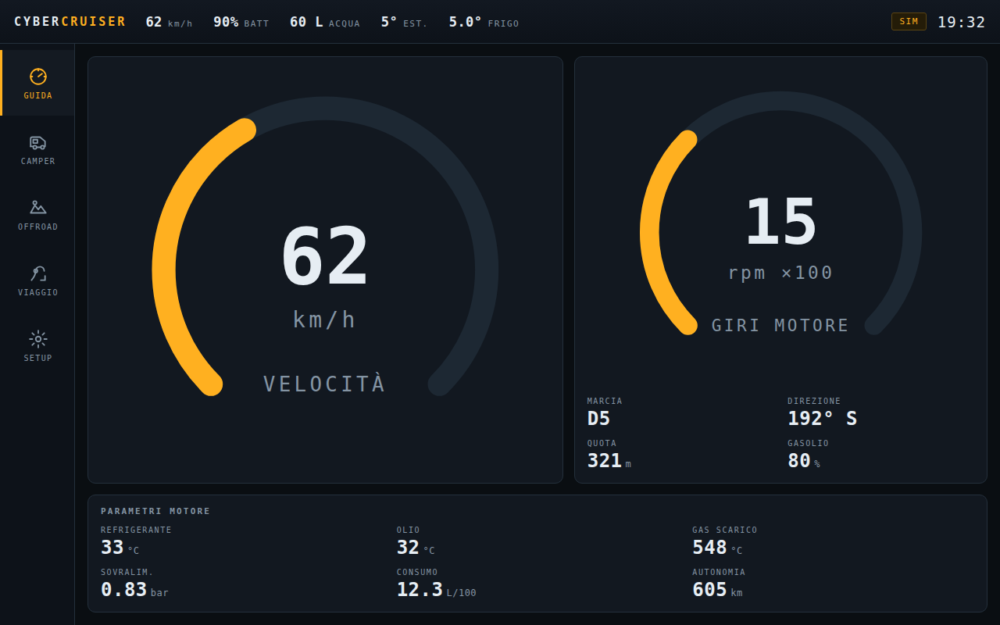

# CYBER CRUISER DASH — software dello schermo di bordo

Dashboard touch per Land Cruiser camperizzato. Nessuna dipendenza, nessun build
step, nessuna rete: HTML + CSS + moduli ES puri, pensata per girare in Chromium
kiosk su un Raspberry Pi 5 con schermo 10,1" 1280×800.



## Le cinque schermate

| | Contenuto | Quando la usi |
|---|---|---|
| **GUIDA** | velocità, giri, marcia, temperature motore, sovralimentazione, consumo, autonomia | in movimento |
| **CAMPER** | batteria servizi, solare, alternatore, serbatoi, frigo, comandi luci/pompa/riscaldatore | in sosta |
| **OFFROAD** | inclinometro pitch/roll con orizzonte artificiale, bussola, quota, pendenza, coordinate | su sterrato |
| **VIAGGIO** | tratta, medie, dislivello, bilancio energetico, resa solare | a fine giornata |
| **SETUP** | sorgente dati, calibrazioni, capacità serbatoi, soglie di allarme | una volta ogni tanto |

Tasti `1`-`5` per cambiare schermata (comodo con una tastiera Bluetooth in cabina).

## Avvio in sviluppo

```bash
python3 -m http.server 8080
# http://localhost:8080          → prova il daemon, poi ripiega sul simulatore
# http://localhost:8080/?sim=1   → forza il simulatore
# http://localhost:8080/?ws=ws://192.168.1.50:8765  → daemon su un altro host
```

Il **simulatore** modella un viaggio di montagna: tratti in marcia e soste, marce
dell'automatico, temperature che salgono, batteria che si carica al sole e si
scarica di notte. Serve per lavorare sull'interfaccia senza il mezzo.

## Build single-file

```bash
node tools/build-single.mjs   # → dist/cyber-cruiser.html (~70 kB)
```

Un unico file apribile da chiavetta o da telefono, senza server.

## In macchina: daemon + kiosk

```bash
# sul Raspberry
pip install websockets python-obd pyserial smbus2 gps3
python3 pi/telemetry.py --obd /dev/ttyUSB0 --vedirect /dev/ttyUSB1 --mppt /dev/ttyUSB2
```

Servizio systemd (`/etc/systemd/system/cybercruiser.service`):

```ini
[Unit]
Description=Cyber Cruiser telemetry daemon
After=network.target

[Service]
ExecStart=/usr/bin/python3 /home/pi/dash/pi/telemetry.py --vedirect /dev/ttyUSB1
Restart=always
RestartSec=3
User=pi

[Install]
WantedBy=multi-user.target
```

Chromium in kiosk, all'avvio della sessione grafica:

```bash
chromium-browser --kiosk --incognito --noerrdialogs \
  --disable-features=TranslateUI --check-for-update-interval=31536000 \
  --autoplay-policy=no-user-gesture-required \
  http://localhost:8080/?ws=ws://localhost:8765
```

Servi la cartella `dash/` con `python3 -m http.server 8080` (secondo servizio
systemd) oppure apri direttamente `dist/cyber-cruiser.html` da `file://`.

## Struttura

```
dash/
  index.html            scheletro: barra, navigazione, area schermate, allarmi
  css/dash.css          tema scuro, layout, widget, adattamento a schermi piccoli
  js/
    app.js              avvio, sorgenti, navigazione, allarmi, ciclo a 5 Hz
    store.js            stato globale + patch + storico + impostazioni persistenti
    sources/simulator.js  dati simulati (sviluppo senza veicolo)
    sources/bridge.js     WebSocket verso il daemon, con riconnessione automatica
    ui/widgets.js         Gauge, Stat, Bar, Toggle, Tilt, Spark
    views/*.js            le cinque schermate
  pi/telemetry.py       daemon: OBD-II, VE.Direct, IMU, GPS, 1-Wire, relè
  tools/build-single.mjs  bundler single-file
```

### Regole di progetto

- **Le viste non scrivono nello stato.** Le sorgenti applicano patch, le viste
  leggono. I comandi partono dalla UI ma diventano stato solo quando il daemon
  conferma: sullo schermo vedi il mondo reale, non le tue intenzioni.
- **Il DOM si costruisce una volta.** Ogni widget aggiorna solo i valori: niente
  re-render, CPU bassa, nessuno sfarfallio sotto le dita.
- **Ogni sorgente degrada da sola.** Manca l'OBD? Restano batteria e serbatoi.
  Manca tutto? Simulatore. La dashboard non deve mai essere una schermata nera.

Il protocollo dati e i collegamenti hardware sono in
[../docs/05-elettronica-schermo.md](../docs/05-elettronica-schermo.md).
